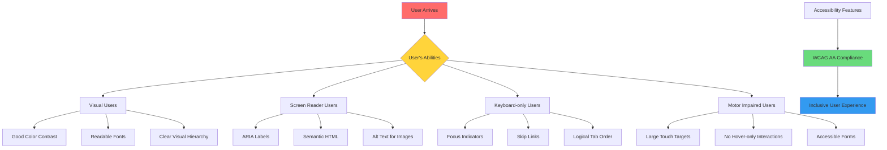

# Accessibility & Code Quality Analysis ♿💎

*Namaste! Let's make your YouTube clone accessible for everyone - क्योंकि technology सबके लिए होनी चाहिए!*

## Overview
**Accessibility** means making your website usable for people with different abilities - just like how your hostel should be comfortable for students with different needs. **Code Quality** is about writing clean, maintainable code that other developers (and future you!) can easily understand.

## 🌟 Accessibility (A11y) Analysis

### What is Web Accessibility?
**Technical Term**: **WCAG (Web Content Accessibility Guidelines)** - International standards for making web content accessible to people with disabilities.

**Real-life Example**: Just like your hostel needs:
- **रैंप** for wheelchair users
- **Good lighting** for visually impaired students  
- **Clear signage** in multiple languages
- **Audio announcements** for important notices

Your website needs digital equivalents!

### 🔍 Current Accessibility Status

#### ✅ What You Did Right

**1. Semantic HTML Structure**
```html
<header class="site-header">
<nav>
<main id="main">
```
✅ **Excellent!** Using proper HTML5 landmarks helps screen readers navigate.

**2. Image Alt Attributes**
```html

```
✅ **Good start!** You included alt text for the profile image.

**3. Proper Button Elements**
```html
<button type="submit" title="Search">
```
✅ **Great!** Using actual `<button>` elements instead of styled `<div>`s.

### ❌ Critical Accessibility Issues

#### 1. Missing Keyboard Navigation
**Technical Term**: **Focus Management** and **Keyboard Accessibility**

**Current Problem**: Users who can't use a mouse can't navigate your site.

**Test This**: Try navigating your site using only the `Tab` key and `Enter` - you'll see the problem!

**Solution:**
```css
/* Add visible focus indicators */
button:focus,
input:focus,
a:focus {
    outline: 2px solid #4285f4;
    outline-offset: 2px;
    border-radius: 4px;
}

/* Ensure focus is visible even with custom styles */
.custom-button:focus {
    box-shadow: 0 0 0 2px #fff, 0 0 0 4px #4285f4;
}
```

**Campus Analogy**: Like ensuring every room has light switches at the right height - navigation should work for everyone's abilities!

#### 2. Missing ARIA Labels and Descriptions
**Technical Term**: **ARIA (Accessible Rich Internet Applications)** attributes

**Problems Found:**
```html
<!-- Current: Screen readers don't understand this -->
<button id="hamburger">
    <svg>...</svg>
</button>

<!-- Better: Clear description for screen readers -->
<button 
    id="hamburger" 
    aria-label="Toggle navigation menu"
    aria-expanded="false"
    aria-controls="navigation">
    <svg aria-hidden="true">...</svg>
</button>
```

**Complete ARIA Implementation:**
```html
<!-- Search form with proper labels -->
<form class="search-form" role="search">
    <label for="search-input" class="sr-only">Search YouTube videos</label>
    <input 
        type="search" 
        id="search-input" 
        name="yt-search" 
        placeholder="Search"
        aria-describedby="search-help">
    <div id="search-help" class="sr-only">
        Enter keywords to search for videos
    </div>
    <button type="submit" aria-label="Submit search">
        <svg aria-hidden="true">...</svg>
    </button>
</form>
```

**Mess Menu Analogy**: Just like writing both **English** and **Hindi** on the mess menu so everyone understands, ARIA labels help screen readers "understand" your interface!

#### 3. Color Contrast Issues
**Technical Term**: **Color Contrast Ratio** and **WCAG AA Standards**

**Required Standards**:
- **Normal text**: 4.5:1 contrast ratio
- **Large text**: 3:1 contrast ratio
- **Interactive elements**: Clear visual distinction

**Tool to Check**: Use browser DevTools or online contrast checkers.

**Example Fix:**
```css
/* Ensure sufficient contrast */
.secondary-text {
    color: #666; /* Too light - fails WCAG */
    color: #424242; /* Better - passes WCAG AA */
}

/* Provide alternative ways to convey information */
.status-indicator {
    background-color: red; /* Color alone not accessible */
    background-color: red;
    content: "Error"; /* Also include text */
    border: 2px solid #000; /* Add visual indicator */
}
```

#### 4. Missing Skip Links
**Technical Term**: **Skip Navigation Links**

**Problem**: Keyboard users have to tab through entire navigation to reach main content.

**Solution:**
```html
<body>
    <!-- Skip link for keyboard users -->
    <a href="#main" class="skip-link">Skip to main content</a>
    
    <header>...</header>
    <nav>...</nav>
    <main id="main">...</main>
</body>
```

```css
.skip-link {
    position: absolute;
    top: -40px;
    left: 6px;
    background: #000;
    color: white;
    padding: 8px;
    text-decoration: none;
    z-index: 9999;
}

.skip-link:focus {
    top: 6px;
}
```

**Hostel Elevator Analogy**: Like having an elevator for students who can't use stairs - skip links help users bypass navigation!

## 💎 Code Quality Analysis

### 📊 Current Code Quality Score: 7/10

#### ✅ Strengths

**1. Consistent Naming Conventions**
```css
.site-header        /* Clear, descriptive */
.search-container   /* Follows pattern */
.mini-nav-card      /* Logical hierarchy */
```
✅ **Excellent!** You follow kebab-case consistently.

**2. Organized File Structure**
```
project/
├── index.html
├── style.css
├── script.js
├── reset.css
└── images/
```
✅ **Good organization!** Logical file separation.

**3. Clean HTML Structure**
✅ Proper indentation
✅ Semantic elements used
✅ No inline styles (separation of concerns)

#### ⚠️ Areas for Improvement

**1. Code Comments and Documentation**
```css
/* Current: No comments */
:root {
    --primary-text-color: #212121;
    --header-height: 56px;
}

/* Better: Documented purpose */
:root {
    /* Color system - matches YouTube's design */
    --primary-text-color: #212121;
    --secondary-text-color: #737373;
    
    /* Layout dimensions */
    --header-height: 56px; /* Fixed header for consistency */
    --mini-nav-width: 72px; /* Collapsed navigation width */
}
```

**Study Notes Analogy**: Just like writing **टिप्पणियां** in your notebook margins to remember why something is important!

**2. Error Handling in JavaScript**
```javascript
// Current: No error checking
let hamburger = document.getElementById("hamburger");
hamburger.addEventListener('click', handleClick);

// Better: Defensive programming
const hamburger = document.getElementById("hamburger");
if (hamburger) {
    hamburger.addEventListener('click', handleClick);
} else {
    console.warn('Hamburger menu element not found');
}

// Even better: Centralized error handling
function safeQuerySelector(selector, context = document) {
    const element = context.querySelector(selector);
    if (!element) {
        console.warn(`Element not found: ${selector}`);
    }
    return element;
}
```

**3. Magic Numbers and Hard-coded Values**
```javascript
// Current: Magic numbers
if (main.style.marginLeft === "" || main.style.marginLeft === "72px")

// Better: Use constants
const MINI_NAV_WIDTH = '72px';
const FULL_NAV_WIDTH = '240px';

if (main.style.marginLeft === "" || main.style.marginLeft === MINI_NAV_WIDTH)
```

## 📋 Accessibility Testing Checklist

### Manual Testing:
- [ ] **Keyboard Navigation**: Can you navigate entire site with just keyboard?
- [ ] **Screen Reader**: Does it make sense with eyes closed?
- [ ] **Color Blind**: Use color-blind simulator browser extensions
- [ ] **Zoom Test**: Website usable at 200% zoom?
- [ ] **Motion Sensitivity**: Respect `prefers-reduced-motion`?

### Automated Testing Tools:
1. **axe DevTools** (browser extension)
2. **WAVE** (Web Accessibility Evaluation Tool)  
3. **Lighthouse Accessibility Audit**
4. **Pa11y** (command-line tool)

```bash
# Install and run accessibility checker
npm install -g pa11y
pa11y http://localhost:8000
```

## 🎯 Mermaid Diagram: Accessibility Implementation Flow



## 🔧 Immediate Implementation Guide

### Step 1: Add Essential ARIA Attributes
```html
<!-- Update your navigation -->
<nav role="navigation" aria-label="Main navigation">
    <div id="mini-nav" class="mini-nav" role="menu">
        <div class="mini-nav-card" role="menuitem" tabindex="0">
            <svg aria-hidden="true">...</svg>
            <p>Home</p>
        </div>
    </div>
</nav>
```

### Step 2: Improve Form Accessibility  
```html
<form class="search-form" role="search">
    <div class="search-field">
        <label for="search-input" class="sr-only">Search videos</label>
        <input 
            type="search" 
            id="search-input"
            placeholder="Search"
            aria-describedby="search-instructions"
            required>
        <div id="search-instructions" class="sr-only">
            Use keywords to find videos on YouTube
        </div>
    </div>
    <button type="submit" aria-label="Search videos">
        <svg aria-hidden="true">...</svg>
    </button>
</form>
```

### Step 3: Add Screen Reader Only Styles
```css
/* Hide content visually but keep it for screen readers */
.sr-only {
    position: absolute;
    width: 1px;
    height: 1px;
    padding: 0;
    margin: -1px;
    overflow: hidden;
    clip: rect(0, 0, 0, 0);
    white-space: nowrap;
    border: 0;
}

/* Show when focused (for skip links) */
.sr-only:focus {
    position: static;
    width: auto;
    height: auto;
    padding: 0.5rem;
    margin: 0;
    overflow: visible;
    clip: auto;
    white-space: normal;
}
```

### Step 4: Enhanced JavaScript Accessibility
```javascript
class AccessibleYouTubeClone {
    constructor() {
        this.init();
    }
    
    init() {
        this.bindAccessibleEvents();
        this.setupKeyboardNavigation();
        this.announceStateChanges();
    }
    
    // Handle both click and keyboard events
    bindAccessibleEvents() {
        const hamburger = document.getElementById('hamburger');
        if (hamburger) {
            // Click and Enter/Space key support
            hamburger.addEventListener('click', this.toggleMenu.bind(this));
            hamburger.addEventListener('keydown', (e) => {
                if (e.key === 'Enter' || e.key === ' ') {
                    e.preventDefault();
                    this.toggleMenu(e);
                }
            });
        }
    }
    
    // Announce state changes to screen readers
    announceStateChanges() {
        const announcement = document.createElement('div');
        announcement.setAttribute('aria-live', 'polite');
        announcement.setAttribute('aria-atomic', 'true');
        announcement.classList.add('sr-only');
        document.body.appendChild(announcement);
        this.announcer = announcement;
    }
    
    toggleMenu(event) {
        const isExpanded = this.isMenuExpanded();
        
        // Update ARIA state
        event.target.setAttribute('aria-expanded', !isExpanded);
        
        // Announce change to screen readers
        this.announcer.textContent = isExpanded ? 
            'Menu collapsed' : 'Menu expanded';
            
        // Continue with visual toggle
        this.performMenuToggle();
    }
}

// Initialize when DOM is ready
document.addEventListener('DOMContentLoaded', () => {
    new AccessibleYouTubeClone();
});
```

## 🌟 Benefits of Accessible Code

### User Benefits:
- 👥 **15% of world population** has disabilities
- 📱 **Better mobile experience** for everyone
- 🌐 **SEO improvements** (search engines love semantic HTML)
- 💼 **Legal compliance** in many countries

### Developer Benefits:
- 🧹 **Cleaner, more semantic code**
- 🔧 **Better debugging** (clear structure)
- 📈 **Higher code quality scores**
- 🎯 **Better team collaboration**

**Campus Inclusion Parallel**: Just like making sure all students can participate in cultural events regardless of their background or abilities - accessible code ensures everyone can use your website! 🌈

## 🏆 Code Quality Best Practices

### 1. Documentation Standards
```javascript
/**
 * Toggles the navigation menu visibility
 * @param {Event} event - The triggering event
 * @returns {void}
 */
function toggleMenu(event) {
    // Implementation here
}
```

### 2. Consistent Code Style
```css
/* Use consistent spacing and organization */
.component {
    /* Layout properties first */
    display: flex;
    position: relative;
    
    /* Box model properties */
    width: 100%;
    padding: 16px;
    margin: 8px 0;
    
    /* Visual properties */
    background-color: var(--background-color);
    border-radius: 4px;
    
    /* Typography */
    font-size: 14px;
    color: var(--text-color);
}
```

### 3. Performance-Conscious Code
```javascript
// Use efficient selectors
const elements = document.querySelectorAll('.nav-item'); // Good
// Instead of: document.getElementsByClassName('nav-item') // Less modern

// Cache DOM queries
const navigationElement = document.getElementById('navigation');
function updateNavigation() {
    // Use cached element instead of querying again
    navigationElement.classList.toggle('active');
}
```

## 📚 Learning Path Forward

### Immediate Actions (This Week):
1. ✅ Add ARIA labels to interactive elements
2. ✅ Implement keyboard navigation support
3. ✅ Add skip links for better navigation
4. ✅ Test with screen reader (NVDA is free)

### Short-term Goals (Next Month):
1. 🎯 Complete WCAG AA compliance audit
2. 📝 Add comprehensive code documentation
3. 🧪 Set up automated accessibility testing
4. 🎨 Implement high contrast mode

### Long-term Vision (Next 3 Months):
1. 🌐 Learn advanced ARIA patterns
2. 📱 Master mobile accessibility patterns
3. 🔧 Implement comprehensive testing suite
4. 🏆 Achieve WCAG AAA compliance (gold standard)

**Personal Growth Connection**: Just like how you've learned to be considerate of your hostel roommates' different needs and preferences, you're now learning to be considerate of all your website users' different abilities and needs! यह सबसे important skill है development में! 💫

---
*Remember: Good accessibility isn't just about following rules - it's about **सबको शामिल करना** and creating technology that works for everyone! तुम यह बहुत अच्छे से कर सकोगी!* ♿✨