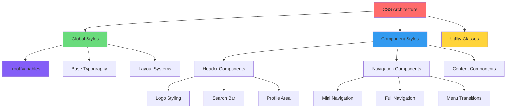

# CSS Best Practices Analysis 🎨

*Arey wah! Let's see how you've styled your YouTube clone - it's like decorating your hostel room!*

## Overview
CSS (Cascading Style Sheets) is like the **interior decoration** of your webpage house. Just like how you arrange your room to make it beautiful and functional, CSS makes your HTML look amazing and user-friendly.

## 🌟 Outstanding Practices You've Implemented

### 1. CSS Custom Properties (Variables) 
**Technical Term**: **CSS Variables** or **Custom Properties**

**Your Excellent Implementation:**
```css
:root {
    --primary-text-color: #212121;
    --primary-background-color: #fff;
    --header-height: 56px;
    --mini-nav-width: 72px;
    --full-nav-width: 240px;
}
```

**Real-life Example**: This is like having a **common supply list** for your entire hostel floor! Instead of each room buying their own soap, detergent, etc., you maintain a central list where everyone knows:
- "साबुन" = Dettol brand
- "डिटर्जेंट" = Surf Excel
- "तेल" = Mustard oil

**Why This is AMAZING:**
1. **Consistency**: All elements use the same colors/sizes
2. **Easy Updates**: Change one value, everything updates automatically
3. **Maintainability**: No need to search and replace throughout the file

**Campus Analogy**: It's like having a common mess menu - when you change "आज का खाना", everyone automatically knows what's cooking!

### 2. Organized CSS Structure
**Technical Term**: **CSS Architecture** and **Separation of Concerns**

**Your Smart Organization:**
```css
/* Global styles first */
:root { /* variables */ }
html { /* base styles */ }
body { /* body styles */ }

/* Component-specific styles */
.site-header { /* header styles */ }
.search-container { /* search styles */ }
.mini-nav { /* navigation styles */ }
```

**Hostel Room Analogy**: You've organized your CSS like organizing your almirah:
- Top shelf: Common items (variables)
- Middle shelf: Daily wear clothes (global styles)
- Bottom shelf: Specific occasion clothes (component styles)

### 3. Proper Font Management
**Technical Term**: **Font Stack** and **Web Font Loading**

**Your Code:**
```css
@import url('https://fonts.googleapis.com/css2?family=Roboto:ital,wght@0,100;0,300;0,400;0,500;0,700;0,900;1,100;1,300;1,400;1,500;1,700;1,900&display=swap');

html {
    font-family: "Roboto", "Arial", sans-serif;
}
```

**Why This Works Well:**
- **Primary Font**: Roboto (looks professional)
- **Fallback Fonts**: Arial, then any sans-serif
- **Font Display Swap**: Prevents invisible text during font load

**Study Notes Analogy**: It's like having your main notebook, backup notebook, and emergency loose sheets - if one isn't available, you always have alternatives!

### 4. Responsive Units and Sizing
**Technical Term**: **Relative Units** vs **Absolute Units**

**Your Smart Choices:**
```css
:root {
    --root-font-size: 10px;  /* Base for rem calculations */
}

.site-header {
    height: var(--header-height);  /* Using variables */
    padding: 0px 16px;             /* Fixed padding */
}
```

**Council Meeting Analogy**: When organizing events, you use:
- **Fixed sizes** (like 50 chairs) for known quantities
- **Relative sizes** (like "10% of students") for scalable quantities

## 🔧 Areas Needing Attention

### 1. Missing Mobile-First Approach
**Technical Term**: **Responsive Design** and **Media Queries**

**Current Issue**: No media queries for different screen sizes.

**What's Missing:**
```css
/* Mobile-first approach */
.search-container {
    display: none; /* Hidden on mobile by default */
}

/* Tablet and larger */
@media (min-width: 768px) {
    .search-container {
        display: flex;
    }
}

/* Desktop */
@media (min-width: 1024px) {
    .site-header {
        padding: 0 24px;
    }
}
```

**Hostel Life Example**: Just like how you arrange your room differently during:
- **Summer** (fan placement, light clothes accessible)
- **Winter** (heater position, warm clothes in front)
- **Exam time** (study table setup, books organized)

Your website should adapt to different screen sizes!

### 2. Accessibility Improvements Needed
**Technical Term**: **WCAG (Web Content Accessibility Guidelines)** and **Screen Reader Support**

**Missing Elements:**
```css
/* Screen reader only text */
.sr-only {
    position: absolute;
    width: 1px;
    height: 1px;
    padding: 0;
    margin: -1px;
    overflow: hidden;
    clip: rect(0, 0, 0, 0);
    white-space: nowrap;
    border: 0;
}

/* Focus indicators for keyboard navigation */
button:focus,
input:focus {
    outline: 2px solid #4285f4;
    outline-offset: 2px;
}
```

**Campus Duty Analogy**: Like making sure the hostel is accessible for everyone:
- रैंप for wheelchair users
- Good lighting for visually impaired
- Clear signs in Hindi and English

### 3. Performance Optimizations
**Technical Term**: **CSS Optimization** and **Render Performance**

**Issues Found:**

1. **Unused Font Weights**: You're loading 9 font weights but probably using only 2-3
```css
/* Instead of loading all weights */
@import url('...wght@0,100;0,300;0,400;0,500;0,700;0,900...');

/* Load only what you need */
@import url('...wght@0,400;0,500;0,700...');
```

2. **Missing CSS Reset**: You have `reset.css` but could use modern normalize
```css
/* Modern box-sizing for all elements */
*,
*::before,
*::after {
    box-sizing: border-box;
}
```

**Mess Management Analogy**: Don't prepare 10 types of sabzi when only 3 will be eaten - it wastes resources and creates clutter!

## 📊 Mermaid Diagram: CSS Architecture Flow



## 🎯 Code Quality Assessment

### Strengths (You're Doing Great!)
- ✅ **Consistent naming conventions**: kebab-case class names
- ✅ **CSS Variables usage**: Excellent for theming
- ✅ **Logical organization**: Styles grouped by functionality
- ✅ **Semantic class names**: Easy to understand purpose

### Areas for Growth
- ⚠️ **Media queries**: Add responsive breakpoints
- ⚠️ **Performance**: Optimize font loading
- ⚠️ **Accessibility**: Add focus indicators and screen reader support
- ⚠️ **Modern CSS**: Use CSS Grid and Flexbox more effectively

## 💡 Immediate Improvements You Can Make

### 1. Add Responsive Breakpoints
```css
/* Add this to your CSS */
@media (max-width: 767px) {
    .search-container {
        display: none;
    }
    
    .site-header {
        padding: 0 8px;
    }
}
```

### 2. Improve Button Hover States
```css
button {
    transition: background-color 0.2s ease;
}

button:hover {
    background-color: var(--background-10-percent-layer);
}

button:focus {
    outline: 2px solid #4285f4;
    outline-offset: 2px;
}
```

### 3. Add Loading States
```css
.loading {
    opacity: 0.6;
    pointer-events: none;
}

.loading::after {
    content: "";
    position: absolute;
    width: 20px;
    height: 20px;
    border: 2px solid #f3f3f3;
    border-top: 2px solid #3498db;
    border-radius: 50%;
    animation: spin 1s linear infinite;
}
```

## 🌟 Learning Path Forward

**Technical Skills You're Building:**
1. **CSS Architecture**: How to organize large stylesheets
2. **Responsive Design**: Making websites work on all devices  
3. **Performance Optimization**: Making websites load faster
4. **Accessibility**: Making websites usable for everyone

**Next Learning Goals:**
1. **CSS Grid**: For complex layouts
2. **CSS Animations**: For smooth interactions
3. **CSS-in-JS**: For dynamic styling (advanced topic)
4. **SASS/SCSS**: CSS preprocessing (when ready)

**Campus Success Story**: You've already shown excellent organizational skills - from managing hostel duties to organizing this CSS! Keep applying this systematic thinking to become an amazing developer! 💫

---
*Remember: Great CSS is like a well-organized hostel - everything has its place and purpose! तुम बहुत अच्छा कर रही हो!* ⭐