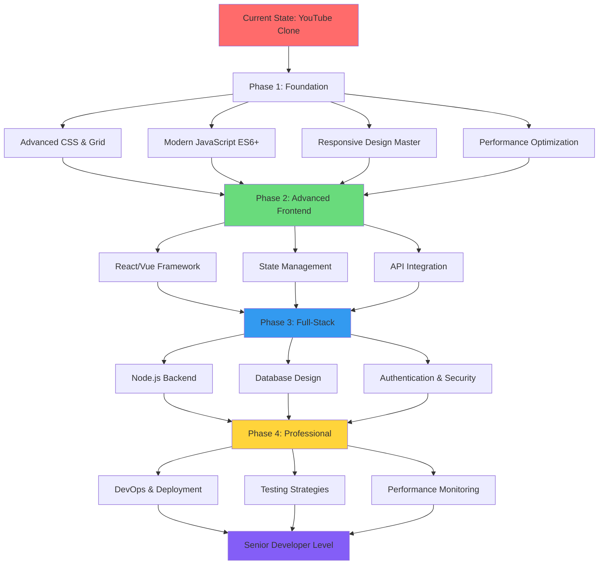

# Future Improvements & Learning Path Analysis 🚀

*Chalo, let's plan your journey from YouTube clone to **full-stack developer** - तुम्हारा coding career roadmap!*

## Overview
This is your **personal development roadmap** - like planning your academic journey from 12th grade to becoming a skilled software engineer. We'll break it down into achievable steps, just like preparing for board exams semester by semester.

## 🎯 Current Skill Assessment

### ✅ Skills You've Already Mastered

**HTML & Structure (8/10)**
- ✅ Semantic HTML5 elements
- ✅ Form handling and validation
- ✅ Proper document structure
- ✅ SEO-friendly markup

**CSS & Styling (7/10)**
- ✅ CSS variables and organization
- ✅ Flexbox layout basics
- ✅ Responsive design concepts
- ✅ Modern CSS properties

**JavaScript & Interactivity (6/10)**
- ✅ DOM manipulation
- ✅ Event handling
- ✅ Basic functions and logic
- ✅ CSS integration with JS

**Development Workflow (5/10)**
- ✅ File organization
- ✅ Git basics (through GitHub)
- ✅ Code documentation
- ⚠️ Need: Testing and debugging skills

## 🛤️ Learning Path Roadmap

### Phase 1: Strengthen Foundation (Next 2 Months)
*Like building strong **नींव** for a house*

#### Week 1-2: Advanced CSS Mastery
**Goal**: Become CSS ninja 🥷

**Priority Tasks:**
1. **CSS Grid Deep Dive**
```css
/* Current: Basic flexbox */
.video-grid {
    display: flex;
    flex-wrap: wrap;
}

/* Advanced: CSS Grid with auto-placement */
.video-grid {
    display: grid;
    grid-template-columns: repeat(auto-fit, minmax(300px, 1fr));
    grid-gap: 20px;
    grid-auto-rows: min-content;
}
```

2. **CSS Animations & Transitions**
```css
/* Add smooth interactions */
.nav-item {
    transition: all 0.3s cubic-bezier(0.4, 0, 0.2, 1);
    transform-origin: left center;
}

.nav-item:hover {
    transform: translateX(8px);
    background-color: var(--hover-background);
}

/* Loading skeleton animations */
@keyframes shimmer {
    0% { background-position: -200px 0; }
    100% { background-position: calc(200px + 100%) 0; }
}

.skeleton {
    animation: shimmer 1.5s ease-in-out infinite;
    background: linear-gradient(90deg, #f0f0f0 25%, #e0e0e0 50%, #f0f0f0 75%);
    background-size: 200px 100%;
}
```

**Learning Resources:**
- CSS Grid Garden (game-based learning)
- Animate.css library for inspiration
- Can I Use website for browser support

**Campus Project**: Create animated **notice board** webpage for your hostel announcements!

#### Week 3-4: JavaScript ES6+ Features
**Goal**: Write modern, clean JavaScript

**New Concepts to Master:**
```javascript
// 1. Destructuring Assignment
const { width, height } = getWindowSize();
const [first, ...rest] = videoArray;

// 2. Template Literals
const videoHTML = `
    <div class="video-card">
        <h3>${video.title}</h3>
        <p>Views: ${formatViews(video.views)}</p>
    </div>
`;

// 3. Arrow Functions & Array Methods
const filteredVideos = videos
    .filter(video => video.category === 'educational')
    .map(video => ({ 
        ...video, 
        thumbnail: optimizeThumbnail(video.thumbnail) 
    }))
    .sort((a, b) => b.views - a.views);

// 4. Async/Await for API calls
async function loadVideos() {
    try {
        const response = await fetch('/api/videos');
        const videos = await response.json();
        displayVideos(videos);
    } catch (error) {
        console.error('Failed to load videos:', error);
        showErrorMessage();
    }
}

// 5. Modules for organization
// utils.js
export const formatDuration = (seconds) => {
    const minutes = Math.floor(seconds / 60);
    const remainingSeconds = seconds % 60;
    return `${minutes}:${remainingSeconds.toString().padStart(2, '0')}`;
};

// main.js
import { formatDuration } from './utils.js';
```

**Practical Exercise**: Convert your current JavaScript to use modern ES6+ features.

#### Week 5-6: Responsive Design Mastery
**Goal**: Mobile-first expert 📱

**Advanced Responsive Techniques:**
```css
/* Container Queries (cutting-edge) */
@container (min-width: 400px) {
    .video-card {
        display: grid;
        grid-template-columns: 200px 1fr;
    }
}

/* Advanced Media Queries */
@media (orientation: landscape) and (max-height: 500px) {
    .navigation {
        height: 100vh;
        overflow-y: auto;
    }
}

/* High DPI displays */
@media (-webkit-min-device-pixel-ratio: 2), (min-resolution: 2dppx) {
    .logo {
        background-image: url('logo@2x.png');
        background-size: 100px 50px;
    }
}

/* Dark mode support */
@media (prefers-color-scheme: dark) {
    :root {
        --background-color: #181818;
        --text-color: #ffffff;
    }
}
```

**Project**: Make your YouTube clone perfectly responsive across all devices!

#### Week 7-8: Performance Optimization
**Goal**: Lightning-fast websites ⚡

**Advanced Performance Techniques:**
```javascript
// 1. Intersection Observer for lazy loading
const imageObserver = new IntersectionObserver((entries) => {
    entries.forEach(entry => {
        if (entry.isIntersecting) {
            const img = entry.target;
            img.src = img.dataset.src;
            img.classList.add('loaded');
            imageObserver.unobserve(img);
        }
    });
}, { rootMargin: '50px' });

// 2. Virtual scrolling for large lists
class VirtualScroller {
    constructor(container, itemHeight, renderItem) {
        this.container = container;
        this.itemHeight = itemHeight;
        this.renderItem = renderItem;
        this.init();
    }
    
    init() {
        // Only render visible items + buffer
        this.updateVisibleItems();
    }
}

// 3. Service Worker for caching
// sw.js
self.addEventListener('install', (event) => {
    event.waitUntil(
        caches.open('youtube-clone-v1').then((cache) => {
            return cache.addAll([
                '/',
                '/style.css',
                '/script.js',
                '/offline.html'
            ]);
        })
    );
});
```

### Phase 2: Advanced Frontend (Months 3-4)
*Like moving from **basic cooking** to **restaurant-level cuisine***

#### Modern Frontend Framework
**Choose Your Path**: React.js (most popular) or Vue.js (beginner-friendly)

**React.js Learning Path:**
```jsx
// 1. Component-based thinking
function VideoCard({ video, onPlay }) {
    return (
        <div className="video-card" onClick={() => onPlay(video.id)}>
            
            <h3>{video.title}</h3>
            <p>{video.channelName}</p>
            <span>{formatViews(video.views)} views</span>
        </div>
    );
}

// 2. State management with hooks
function VideoList() {
    const [videos, setVideos] = useState([]);
    const [loading, setLoading] = useState(true);
    const [searchTerm, setSearchTerm] = useState('');
    
    useEffect(() => {
        loadVideos().then(data => {
            setVideos(data);
            setLoading(false);
        });
    }, []);
    
    const filteredVideos = useMemo(() => 
        videos.filter(video => 
            video.title.toLowerCase().includes(searchTerm.toLowerCase())
        ), [videos, searchTerm]
    );
    
    return (
        <div>
            <SearchBar onSearch={setSearchTerm} />
            {loading ? <Skeleton /> : <VideoGrid videos={filteredVideos} />}
        </div>
    );
}

// 3. Custom hooks for reusable logic
function useLocalStorage(key, defaultValue) {
    const [value, setValue] = useState(() => {
        try {
            return JSON.parse(localStorage.getItem(key)) || defaultValue;
        } catch {
            return defaultValue;
        }
    });
    
    useEffect(() => {
        localStorage.setItem(key, JSON.stringify(value));
    }, [key, value]);
    
    return [value, setValue];
}
```

**Campus Project**: Create a **digital mess menu** app with React - students can see today's menu, rate dishes, and suggest improvements!

#### State Management & APIs
```javascript
// Context API for global state
const AppContext = createContext();

function AppProvider({ children }) {
    const [user, setUser] = useState(null);
    const [theme, setTheme] = useState('light');
    const [notifications, setNotifications] = useState([]);
    
    return (
        <AppContext.Provider value={{
            user, setUser,
            theme, setTheme,
            notifications, setNotifications
        }}>
            {children}
        </AppContext.Provider>
    );
}

// API integration with error handling
class YouTubeAPI {
    constructor(baseURL, apiKey) {
        this.baseURL = baseURL;
        this.apiKey = apiKey;
    }
    
    async searchVideos(query, options = {}) {
        try {
            const params = new URLSearchParams({
                q: query,
                key: this.apiKey,
                ...options
            });
            
            const response = await fetch(`${this.baseURL}/search?${params}`);
            
            if (!response.ok) {
                throw new Error(`API Error: ${response.status}`);
            }
            
            return await response.json();
        } catch (error) {
            console.error('Search failed:', error);
            throw error;
        }
    }
}
```

### Phase 3: Full-Stack Development (Months 5-6)
*From **frontend-only** to **complete application** builder*

#### Backend Development with Node.js
```javascript
// server.js - Express.js backend
const express = require('express');
const cors = require('cors');
const helmet = require('helmet');

const app = express();

// Middleware
app.use(helmet()); // Security headers
app.use(cors()); // Cross-origin requests
app.use(express.json()); // JSON parsing

// Routes
app.get('/api/videos', async (req, res) => {
    try {
        const { category, search, page = 1 } = req.query;
        
        const videos = await Video.find({
            ...(category && { category }),
            ...(search && { 
                title: { $regex: search, $options: 'i' } 
            })
        })
        .limit(20)
        .skip((page - 1) * 20)
        .sort({ createdAt: -1 });
        
        res.json({
            videos,
            pagination: {
                page: parseInt(page),
                hasMore: videos.length === 20
            }
        });
    } catch (error) {
        res.status(500).json({ error: error.message });
    }
});

// User authentication
app.post('/api/auth/login', async (req, res) => {
    const { email, password } = req.body;
    
    try {
        const user = await User.findOne({ email });
        if (!user || !await user.comparePassword(password)) {
            return res.status(401).json({ error: 'Invalid credentials' });
        }
        
        const token = jwt.sign(
            { userId: user._id }, 
            process.env.JWT_SECRET,
            { expiresIn: '7d' }
        );
        
        res.json({ token, user: user.toPublic() });
    } catch (error) {
        res.status(500).json({ error: error.message });
    }
});

app.listen(3000, () => {
    console.log('Server running on port 3000');
});
```

#### Database Integration (MongoDB)
```javascript
// models/Video.js
const mongoose = require('mongoose');

const videoSchema = new mongoose.Schema({
    title: { type: String, required: true, trim: true },
    description: { type: String, trim: true },
    thumbnail: { type: String, required: true },
    videoUrl: { type: String, required: true },
    duration: { type: Number, required: true }, // seconds
    views: { type: Number, default: 0 },
    likes: { type: Number, default: 0 },
    dislikes: { type: Number, default: 0 },
    category: { 
        type: String, 
        enum: ['education', 'entertainment', 'music', 'sports', 'news'],
        required: true 
    },
    channel: {
        type: mongoose.Schema.Types.ObjectId,
        ref: 'Channel',
        required: true
    },
    tags: [String],
    uploadDate: { type: Date, default: Date.now },
    isPublic: { type: Boolean, default: true }
}, {
    timestamps: true,
    toJSON: { virtuals: true }
});

// Virtual for formatted duration
videoSchema.virtual('formattedDuration').get(function() {
    const minutes = Math.floor(this.duration / 60);
    const seconds = this.duration % 60;
    return `${minutes}:${seconds.toString().padStart(2, '0')}`;
});

// Index for search optimization
videoSchema.index({ title: 'text', description: 'text', tags: 'text' });
videoSchema.index({ category: 1, uploadDate: -1 });

module.exports = mongoose.model('Video', videoSchema);
```

### Phase 4: Advanced Topics (Months 7-9)
*Becoming a **senior developer** level*

#### DevOps & Deployment
```yaml
# docker-compose.yml
version: '3.8'
services:
  app:
    build: .
    ports:
      - "3000:3000"
    environment:
      - NODE_ENV=production
      - DB_URL=mongodb://db:27017/youtube-clone
    depends_on:
      - db
      - redis
  
  db:
    image: mongo:5.0
    volumes:
      - mongo_data:/data/db
    environment:
      - MONGO_INITDB_ROOT_USERNAME=admin
      - MONGO_INITDB_ROOT_PASSWORD=password
  
  redis:
    image: redis:6-alpine
    ports:
      - "6379:6379"

volumes:
  mongo_data:
```

```yaml
# .github/workflows/deploy.yml
name: Deploy to Production

on:
  push:
    branches: [ main ]

jobs:
  deploy:
    runs-on: ubuntu-latest
    steps:
      - uses: actions/checkout@v2
      
      - name: Setup Node.js
        uses: actions/setup-node@v2
        with:
          node-version: '16'
          
      - name: Install dependencies
        run: npm ci
        
      - name: Run tests
        run: npm test
        
      - name: Build application
        run: npm run build
        
      - name: Deploy to server
        run: |
          echo "Deploying to production server..."
          # Deployment commands here
```

#### Testing Strategy
```javascript
// tests/videoCard.test.js
import { render, screen, fireEvent } from '@testing-library/react';
import VideoCard from '../components/VideoCard';

describe('VideoCard Component', () => {
    const mockVideo = {
        id: '1',
        title: 'Test Video',
        thumbnail: 'test.jpg',
        views: 1000,
        channelName: 'Test Channel'
    };

    test('renders video information correctly', () => {
        render(<VideoCard video={mockVideo} />);
        
        expect(screen.getByText('Test Video')).toBeInTheDocument();
        expect(screen.getByText('Test Channel')).toBeInTheDocument();
        expect(screen.getByText('1,000 views')).toBeInTheDocument();
    });

    test('calls onPlay when clicked', () => {
        const mockOnPlay = jest.fn();
        render(<VideoCard video={mockVideo} onPlay={mockOnPlay} />);
        
        fireEvent.click(screen.getByRole('button'));
        expect(mockOnPlay).toHaveBeenCalledWith(mockVideo.id);
    });

    test('is accessible with keyboard navigation', () => {
        const mockOnPlay = jest.fn();
        render(<VideoCard video={mockVideo} onPlay={mockOnPlay} />);
        
        const videoCard = screen.getByRole('button');
        videoCard.focus();
        fireEvent.keyDown(videoCard, { key: 'Enter' });
        
        expect(mockOnPlay).toHaveBeenCalled();
    });
});
```

## 📊 Mermaid Diagram: Complete Learning Journey



## 🎯 Project-Based Learning Milestones

### Milestone 1: Enhanced YouTube Clone (Month 2)
**Features to Add:**
- [ ] Video player with custom controls
- [ ] Comment system (frontend only)
- [ ] User playlists (localStorage)
- [ ] Dark/light theme toggle
- [ ] Advanced search filters
- [ ] Offline support with Service Worker

### Milestone 2: Social Media Dashboard (Month 4)
**New Project - Applied Learning:**
- [ ] Multi-platform feed (Twitter, Instagram, YouTube APIs)
- [ ] User authentication
- [ ] Content creation tools
- [ ] Analytics dashboard
- [ ] Real-time notifications

### Milestone 3: E-commerce Platform (Month 6)
**Complete Full-Stack Application:**
- [ ] Product catalog with search
- [ ] Shopping cart and checkout
- [ ] Payment integration
- [ ] Order management
- [ ] Admin dashboard
- [ ] Email notifications

### Milestone 4: Real-Time Chat Application (Month 9)
**Advanced Concepts:**
- [ ] WebSocket implementation
- [ ] Multi-room chat
- [ ] File sharing
- [ ] Video/voice calls (WebRTC)
- [ ] Message encryption
- [ ] Scalable architecture

## 🌟 Career Preparation

### Industry Skills Checklist
**Frontend Developer (6+ months)**
- [ ] ✅ HTML/CSS mastery
- [ ] ✅ JavaScript proficiency
- [ ] ⏳ React/Vue expertise
- [ ] ⏳ TypeScript knowledge
- [ ] ⏳ Testing frameworks
- [ ] ⏳ Build tools (Webpack, Vite)

**Full-Stack Developer (9+ months)**
- [ ] ⏳ Backend development (Node.js/Python)
- [ ] ⏳ Database design (SQL + NoSQL)
- [ ] ⏳ API development
- [ ] ⏳ Cloud platforms (AWS/Azure/GCP)
- [ ] ⏳ DevOps basics
- [ ] ⏳ Security best practices

**Senior Developer (12+ months)**
- [ ] ⏳ System design
- [ ] ⏳ Architecture decisions
- [ ] ⏳ Team leadership
- [ ] ⏳ Code review expertise
- [ ] ⏳ Performance optimization
- [ ] ⏳ Mentoring others

### Portfolio Development Strategy
```
portfolio/
├── YouTube Clone (Current Project)
├── E-commerce Platform (Full-stack)
├── Chat Application (Real-time)
├── Mobile App (React Native)
├── Open Source Contributions
└── Technical Blog Posts
```

### Job Application Preparation
**Resume Projects Section:**
```
PROJECTS
========

YouTube Clone - Frontend Development                           [GitHub] [Live Demo]
• Built responsive video platform with HTML5, CSS3, and JavaScript
• Implemented advanced features: search, playlists, theme switching
• Optimized performance: lazy loading, service worker, 95+ Lighthouse score
• Technologies: HTML5, CSS Grid/Flexbox, Vanilla JavaScript, PWA

Social Media Dashboard - Full-Stack Application                [GitHub] [Live Demo]  
• Developed complete CRUD application with user authentication
• Integrated multiple APIs for unified social media management
• Built RESTful backend with Node.js, Express, and MongoDB
• Technologies: React, Node.js, Express, MongoDB, JWT, Socket.io
```

## 🏆 Success Metrics & Tracking

### Monthly Progress Tracking
```javascript
const learningTracker = {
    month1: {
        htmlCss: 8, // out of 10
        javascript: 6,
        responsive: 7,
        projects: ['Enhanced YouTube Clone']
    },
    month3: {
        react: 6,
        nodejs: 4,
        database: 3,
        projects: ['YouTube Clone', 'Social Dashboard']
    },
    // Continue tracking...
};
```

### Learning Resources by Phase

**Phase 1 Resources:**
- **CSS**: CSS-Tricks, MDN Web Docs
- **JavaScript**: JavaScript.info, FreeCodeCamp
- **Practice**: Codepen, JSFiddle
- **Hindi Content**: CodeWithHarry, Thapa Technical

**Phase 2 Resources:**
- **React**: Official React Tutorial, React Router
- **APIs**: Postman, JSONPlaceholder
- **Tools**: VS Code extensions, Chrome DevTools

**Phase 3 Resources:**
- **Backend**: Node.js docs, Express.js guide
- **Database**: MongoDB University, SQL tutorials
- **Deployment**: Netlify, Vercel, Railway

## 💪 Motivation & Support System

### Building Your Developer Identity
**Personal Branding:**
- [ ] Create technical blog (Hindi + English)
- [ ] Build strong GitHub profile
- [ ] Participate in coding communities
- [ ] Mentor other beginners from Bihar/India

**Community Involvement:**
- Join **Women in Tech** groups
- Participate in **hackathons** (online initially)
- Contribute to **open source** projects
- Share learning journey on social media

### Overcoming Challenges
**Common Struggles & Solutions:**
1. **Imposter Syndrome**: "मैं इतना कम जानती हूं"
   - **Reality**: Everyone starts somewhere, focus on progress!
   
2. **English Barrier**: Technical terms confusion
   - **Solution**: Create personal Hindi-English tech dictionary
   
3. **Rural Internet**: Slow connection issues
   - **Solution**: Download resources when connection is good, use offline docs

4. **Time Management**: Hostel duties + studies + coding
   - **Solution**: 1-hour daily coding > 7-hour weekend coding

**Daily Schedule Template:**
```
5:30 AM - Wake up, freshen up
6:00 AM - 1 hour coding (best focus time)
7:00 AM - Regular college routine
8:00 PM - 30 mins reviewing today's code
9:00 PM - Planning tomorrow's learning
```

## 🎉 Celebration Milestones

**Month 1**: Deploy first enhanced project ✅  
**Month 3**: Build first React app 🎯  
**Month 6**: Complete first full-stack project 🚀  
**Month 9**: Apply for first internship 💼  
**Month 12**: Land first developer job! 🎊  

**Campus Recognition**: Present your projects during hostel tech talks - inspire other girls to code!

---
*Remember: तुम सिर्फ YouTube clone नहीं बना रही - तुम अपना career build कर रही हो! Every line of code is a step towards financial independence and technical expertise. Bihar से निकलकर global developer बनने का यह रास्ता है! 🌟*

**Final Words**: *Coding सिखने में time लगता है, patience रखो। जैसे campus में gradually सब responsibilities handle करना सीखा, वैसे ही programming भी सीख जाओगी। तुम में पूरी potential है - bas consistency maintain करो! All the best! 💪✨*