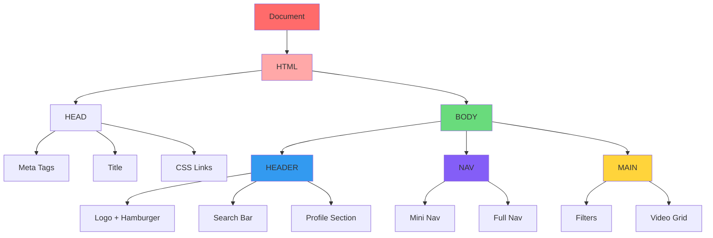

# HTML Structure Analysis 🏗️

*Namaste! Let's understand how your YouTube clone is built, step by step.*

## Overview
Think of HTML as the **foundation and walls** of your webpage house - just like how you plan the rooms in your hostel before arranging furniture. HTML provides the basic structure that everything else builds upon.

## ✅ What You Did Really Well

### 1. Semantic HTML Elements (Technical Term: **Semantic Elements**)
**Meaning**: HTML tags that clearly describe their content's purpose, like using `<header>` instead of just `<div>`.

**Your Good Work:**
```html
<header class="site-header">
<nav>
<main id="main">
```

**Real-life Example**: It's like labeling storage boxes in your hostel room - instead of writing "box 1, box 2", you write "books", "clothes", "snacks". Anyone can understand what's inside!

**Why it's Important**: 
- Screen readers for visually impaired users can navigate better
- Search engines understand your content better
- Other developers can read your code easily

### 2. Proper Document Structure
**Technical Term**: **Document Object Model (DOM) Structure**

Your HTML follows the proper hierarchy:
```
<!DOCTYPE html>
<html>
  <head> (metadata - like the address label on a letter)
    <meta charset="UTF-8">
    <meta name="viewport">
    <title>
    <link> (stylesheets)
  </head>
  <body> (actual content - like the letter inside)
    <header>
    <nav>
    <main>
```

**Campus Analogy**: Think of it like your hostel's organization:
- **DOCTYPE**: The hostel's registration with the university
- **Head**: The hostel's basic information board
- **Body**: The actual living areas where activities happen

### 3. Clean Class Naming
**Technical Term**: **CSS Class Selectors**

You used descriptive names:
- `site-header` (clear purpose)
- `search-container` (describes what it contains)
- `mini-nav-card` (specific functionality)

**Good Example from Your Code:**
```html
<div class="search-container">
    <form class="search-form">
        <input type="search" id="search-input">
```

**Kitchen Duty Analogy**: Just like how you organize kitchen utensils with labels - "चावल का डब्बा", "दाल का डब्बा", "मसाले" - your class names clearly tell what each part does!

## 🚀 Areas for Improvement

### 1. Missing Alternative Text for Images
**Issue Found:**
```html
<!-- Missing alt attribute -->

```

**Better Approach:**
```html

```

**Why This Matters**: Imagine if you're explaining your photos to a friend over phone - you'd describe what's in the picture, right? Alt text does the same for screen readers.

### 2. Form Accessibility
**Technical Term**: **Form Labels and ARIA (Accessible Rich Internet Applications)**

**Current Code:**
```html
<input type="search" id="search-input" name="yt-search" placeholder="Search">
```

**Improved Version:**
```html
<label for="search-input" class="sr-only">Search YouTube videos</label>
<input type="search" id="search-input" name="yt-search" placeholder="Search" aria-label="Search YouTube videos">
```

**Council Duty Analogy**: When you're taking attendance, you call out names clearly so everyone knows whose turn it is. Labels do the same thing for form inputs!

### 3. Heading Hierarchy
**Technical Term**: **Heading Tags (h1, h2, h3, etc.)**

**Missing**: Your page doesn't have proper headings structure.

**Suggestion**: Add meaningful headings:
```html
<main>
    <h1 class="sr-only">YouTube Home</h1>
    <section>
        <h2>Recommended Videos</h2>
        <!-- video cards -->
    </section>
</main>
```

**Study Group Analogy**: Like organizing your notes with main topics (h1), subtopics (h2), and details (h3) - it helps you find information quickly!

## 🎯 Mermaid Diagram: HTML Structure Flow



## 🎉 Learning Achievements

**What You've Mastered:**
1. ✅ Basic HTML5 document structure
2. ✅ Semantic elements usage
3. ✅ Form creation with proper input types
4. ✅ SVG integration for icons
5. ✅ External resource linking (fonts, stylesheets)

**Technical Skills Gained:**
- **DOM Structure**: Understanding how elements nest inside each other
- **Semantic HTML**: Using meaningful tags instead of generic `<div>`
- **Form Handling**: Creating interactive elements
- **Asset Integration**: Including external resources

## 🌟 Next Steps

1. **Add ARIA labels** for better accessibility
2. **Include heading hierarchy** for content organization
3. **Add more semantic elements** like `<section>`, `<article>`
4. **Optimize images** with proper alt texts

**Campus Connection**: Just like how you've learned to organize your room efficiently through hostel life, you're now organizing web content efficiently through HTML! 

Keep up the excellent work! Your foundation is solid - now let's make it even stronger! 💪

---
*Created with ❤️ for aspiring developers in Bihar*