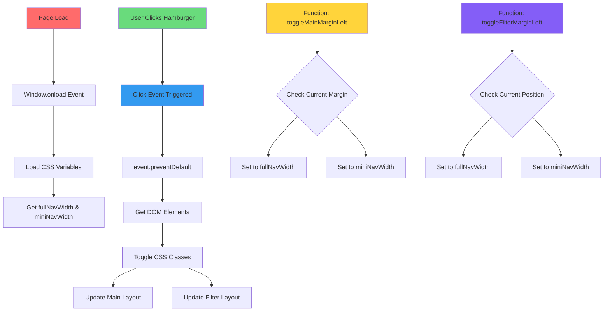

# JavaScript Functionality Analysis ⚡

*Chalo, let's see how you've made your webpage come alive with JavaScript - just like adding **जान** to your project!*

## Overview
JavaScript is like the **electrical wiring** in your hostel - it makes everything interactive and responsive. Without it, your webpage is like a beautiful room with no switches for lights and fans!

## 🎯 Current JavaScript Functionality

### Your Code Overview:
```javascript
let fullNavWidth;
let miniNavWidth;

window.onload = function () {
    const root = document.documentElement;
    const rootStyles = getComputedStyle(root);
    fullNavWidth = rootStyles.getPropertyValue('--full-nav-width').trim();
    miniNavWidth = rootStyles.getPropertyValue('--mini-nav-width').trim();
}

let hamburger = document.getElementById("hamburger");
hamburger.addEventListener('click', (event) => {
    event.preventDefault();
    let miniNav = document.getElementById("mini-nav");
    let fullNav = document.getElementById("full-nav");
    miniNav.classList.toggle('show');
    fullNav.classList.toggle('show');
    toggleMainMarginLeft();
    toggleFilterMarginLeft();
})
```

## ✅ What You Did Excellently Well

### 1. Event-Driven Programming
**Technical Term**: **Event Listeners** and **DOM Manipulation**

**Your Implementation:**
```javascript
hamburger.addEventListener('click', (event) => {
    // Your code handles click events properly
});
```

**Real-life Example**: This is exactly like the **bell system** in your hostel:
- **Event**: Bell rings (click happens)
- **Listener**: You hear the bell (addEventListener)
- **Response**: You know it's time for mess/prayer/study (function executes)

**Why This is Great:**
- ✅ Proper event binding
- ✅ Clean event handling
- ✅ Prevents default behavior with `event.preventDefault()`

### 2. CSS Variable Integration with JavaScript
**Technical Term**: **CSS Custom Property Access** via **getComputedStyle()**

**Your Smart Approach:**
```javascript
const rootStyles = getComputedStyle(root);
fullNavWidth = rootStyles.getPropertyValue('--full-nav-width').trim();
```

**Campus Council Analogy**: This is like checking the **notice board** (CSS variables) to get current rules (values) before making decisions. बहुत smart approach!

**Why This Works Well:**
- ✅ Single source of truth for dimensions
- ✅ CSS and JavaScript stay synchronized
- ✅ Easy to maintain and update

### 3. DOM Element Selection and Manipulation
**Technical Term**: **Document Object Model (DOM) API**

**Your Code:**
```javascript
let miniNav = document.getElementById("mini-nav");
let fullNav = document.getElementById("full-nav");
miniNav.classList.toggle('show');
```

**Kitchen Duty Analogy**: It's like knowing exactly which **डब्बा** (container) to pick from the kitchen shelf and what to do with it - very organized approach!

## 🚀 Areas for Improvement

### 1. Code Organization and Structure
**Technical Term**: **Code Modularity** and **Function Decomposition**

**Current Issue**: Everything is in the global scope (like keeping all your clothes in one pile instead of organized sections).

**Better Approach:**
```javascript
// Create a namespace for your app
const YouTubeClone = {
    // Configuration
    config: {
        fullNavWidth: null,
        miniNavWidth: null
    },
    
    // Initialize the app
    init() {
        this.loadConfig();
        this.bindEvents();
    },
    
    // Load CSS variables
    loadConfig() {
        const root = document.documentElement;
        const rootStyles = getComputedStyle(root);
        this.config.fullNavWidth = rootStyles.getPropertyValue('--full-nav-width').trim();
        this.config.miniNavWidth = rootStyles.getPropertyValue('--mini-nav-width').trim();
    },
    
    // Bind event listeners
    bindEvents() {
        const hamburger = document.getElementById("hamburger");
        if (hamburger) {
            hamburger.addEventListener('click', this.handleMenuToggle.bind(this));
        }
    },
    
    // Handle menu toggle
    handleMenuToggle(event) {
        event.preventDefault();
        this.toggleNavigation();
        this.toggleMainLayout();
    }
};

// Initialize when DOM is ready
document.addEventListener('DOMContentLoaded', () => {
    YouTubeClone.init();
});
```

**Hostel Organization Analogy**: Instead of putting everything in one big trunk, you organize:
- **Study materials** in one section
- **Clothes** in another section  
- **Personal items** separately
- **Common items** in shared space

### 2. Error Handling and Validation
**Technical Term**: **Defensive Programming** and **Error Handling**

**Current Risk**: No checks if elements exist before using them.

**Safer Approach:**
```javascript
handleMenuToggle(event) {
    event.preventDefault();
    
    // Check if elements exist before manipulating
    const miniNav = document.getElementById("mini-nav");
    const fullNav = document.getElementById("full-nav");
    const main = document.getElementById('main');
    
    if (!miniNav || !fullNav || !main) {
        console.warn('Required navigation elements not found');
        return;
    }
    
    // Proceed with toggle logic
    miniNav.classList.toggle('show');
    fullNav.classList.toggle('show');
    
    this.toggleMainLayout();
}
```

**Campus Safety Analogy**: Just like checking if the **gas cylinder** is properly connected before lighting the stove - always verify before taking action!

### 3. Modern JavaScript Features
**Technical Term**: **ES6+ Features** and **Modern JavaScript Syntax**

**Current Code Style**: Using older `var` and `function` declarations.

**Modern Approach:**
```javascript
// Use const/let instead of var
const hamburger = document.getElementById("hamburger");

// Use arrow functions appropriately
const toggleNavigation = () => {
    // Toggle logic here
};

// Use template literals for dynamic strings
const logMessage = (action) => {
    console.log(`Navigation ${action} completed`);
};

// Use destructuring for cleaner code
const { fullNavWidth, miniNavWidth } = this.config;
```

### 4. Missing Accessibility Features
**Technical Term**: **ARIA (Accessible Rich Internet Applications)** Support

**What's Missing:**
```javascript
handleMenuToggle(event) {
    event.preventDefault();
    
    const hamburger = event.target;
    const isExpanded = fullNav.classList.contains('show');
    
    // Update ARIA attributes for screen readers
    hamburger.setAttribute('aria-expanded', !isExpanded);
    hamburger.setAttribute('aria-label', 
        !isExpanded ? 'Close navigation menu' : 'Open navigation menu'
    );
    
    // Rest of toggle logic...
}
```

## 📊 Mermaid Diagram: JavaScript Flow



## 🎮 Interactive Features Analysis

### Current Functionality:
1. **Menu Toggle**: ✅ Working
2. **Navigation Switching**: ✅ Working  
3. **Layout Adjustment**: ✅ Working

### Missing Interactive Features:
1. **Search Functionality**: Not implemented
2. **Video Player Controls**: Not implemented
3. **Responsive Menu**: Partial implementation
4. **Keyboard Navigation**: Missing
5. **Loading States**: Missing

## 💡 Immediate Improvements You Can Add

### 1. Add Search Functionality
```javascript
initSearch() {
    const searchInput = document.getElementById('search-input');
    const searchForm = document.querySelector('.search-form');
    
    if (searchForm) {
        searchForm.addEventListener('submit', (event) => {
            event.preventDefault();
            const query = searchInput.value.trim();
            
            if (query) {
                this.performSearch(query);
            }
        });
    }
},

performSearch(query) {
    console.log(`Searching for: ${query}`);
    // Add your search logic here
    // For now, just show an alert
    alert(`आपने search किया: "${query}"`);
}
```

### 2. Add Keyboard Support
```javascript
bindKeyboardEvents() {
    document.addEventListener('keydown', (event) => {
        // Toggle menu with 'M' key
        if (event.key === 'm' || event.key === 'M') {
            const hamburger = document.getElementById("hamburger");
            if (hamburger) {
                hamburger.click();
            }
        }
        
        // Focus search with '/' key (like YouTube)
        if (event.key === '/') {
            event.preventDefault();
            const searchInput = document.getElementById('search-input');
            if (searchInput) {
                searchInput.focus();
            }
        }
    });
}
```

### 3. Add Loading States
```javascript
showLoading(element) {
    element.classList.add('loading');
    element.setAttribute('aria-busy', 'true');
},

hideLoading(element) {
    element.classList.remove('loading');
    element.removeAttribute('aria-busy');
}
```

## 🌟 Learning Achievements

**JavaScript Concepts You've Applied:**
1. ✅ **Event Handling**: Click events and listeners
2. ✅ **DOM Manipulation**: Changing classes and styles
3. ✅ **CSS Integration**: Reading CSS variables
4. ✅ **Function Organization**: Separate functions for different tasks

**Technical Skills Gained:**
- **addEventListener()**: Handling user interactions
- **getComputedStyle()**: Reading CSS values from JavaScript
- **classList.toggle()**: Dynamic class manipulation
- **getElementById()**: DOM element selection

## 🎯 Next Learning Steps

### Immediate (Next Week):
1. **Add error handling** to prevent crashes
2. **Implement search functionality** for better UX
3. **Add keyboard navigation** for accessibility

### Short-term (Next Month):
1. **Learn async/await** for handling data
2. **Study localStorage** for saving user preferences  
3. **Explore fetch API** for loading video data

### Long-term (Next 3 Months):
1. **React/Vue basics** for component-based development
2. **API integration** for real video data
3. **State management** for complex interactions

## 🏆 Code Quality Score

**Current Level**: Intermediate Beginner (6/10)
- ✅ Basic functionality works
- ✅ Clean event handling
- ⚠️ Needs better organization
- ⚠️ Missing error handling
- ⚠️ Limited accessibility

**Path to Advanced (9/10)**:
1. Add proper error handling
2. Implement modern ES6+ features
3. Add comprehensive accessibility
4. Include performance optimizations

**Campus Pride Moment**: Just like how you've learned to manage hostel responsibilities efficiently, you're now learning to manage code responsibilities! यह progress बहुत अच्छी है! 🌟

---
*Keep coding with confidence - तुम्हारा JavaScript game strong होता जा रहा है!* 🚀