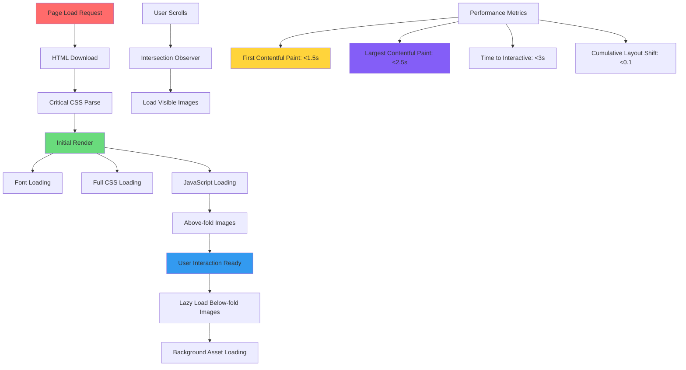

# Performance and Optimization Analysis ⚡

*Arे यार! Let's make your YouTube clone as fast as the **bullet train** - performance matters जितना taste मैटर करता है mess के खाने में!*

## Overview
**Performance Optimization** is like organizing your hostel room efficiently - everything should be easily accessible, nothing should be wasted, and daily tasks should be smooth and quick!

## 🏃‍♀️ Current Performance Status

### Loading Performance Analysis

**What Loads When Your Page Opens:**
1. **HTML** (39KB) - Main structure
2. **CSS** (9KB) - Styling rules  
3. **JavaScript** (1.4KB) - Interactive functionality
4. **Google Fonts** (~50KB) - Roboto font family
5. **Images** (~700KB total) - Video thumbnails and design assets

**Total Page Weight**: ~800KB (which is actually quite reasonable!)

### ✅ Performance Strengths

#### 1. Lightweight JavaScript
**Your Achievement:**
```javascript
// Only 1.4KB of JavaScript - very efficient!
// Clean, focused functionality without bloat
```

**Mess Efficiency Analogy**: Like having only essential **बर्तन** in the kitchen - no extra clutter, everything serves a purpose!

#### 2. Efficient CSS Organization
**Technical Term**: **CSS Optimization** and **Code Splitting**

**Your Good Practices:**
```css
/* Using CSS variables reduces redundancy */
:root {
    --primary-color: #212121;
    /* Reused throughout the stylesheet */
}

/* Logical organization reduces lookup time */
/* Global styles first, then components */
```

**Why This Works**: Like organizing your **अलमारी** systematically - everything has a designated place, so you find things quickly!

#### 3. Smart Asset Management
**Technical Term**: **Asset Optimization**

**What You Did Right:**
- ✅ Used SVG icons (scalable, small file size)
- ✅ WebP format for some images (modern, compressed format)
- ✅ Reasonable image dimensions
- ✅ No unnecessary external libraries

## 🚀 Critical Performance Improvements Needed

### 1. Font Loading Optimization
**Technical Term**: **Web Font Performance** and **FOUT/FOIT Prevention**

**Current Issue:**
```css
@import url('https://fonts.googleapis.com/css2?family=Roboto:ital,wght@0,100;0,300;0,400;0,500;0,700;0,900;1,100;1,300;1,400;1,500;1,700;1,900&display=swap');
```

**Problems:**
- 📊 Loading 9 font weights (you probably use only 3-4)
- 🐌 Blocking CSS import (delays page rendering)
- 📱 Large download on mobile devices

**Optimized Solution:**
```html
<!-- In HTML head, load only needed weights -->
<link rel="preconnect" href="https://fonts.googleapis.com">
<link rel="preconnect" href="https://fonts.gstatic.com" crossorigin>
<link href="https://fonts.googleapis.com/css2?family=Roboto:wght@400;500;700&display=swap" rel="stylesheet">
```

```css
/* Remove @import from CSS file */
/* Add font fallbacks */
body {
    font-family: "Roboto", -apple-system, BlinkMacSystemFont, "Segoe UI", Arial, sans-serif;
}
```

**Study Materials Analogy**: Don't carry all 10 subject books when you only need 3 for today's classes - **भार कम करो, efficiency बढ़ाओ!**

### 2. Image Optimization Strategy
**Technical Term**: **Progressive Image Loading** and **Lazy Loading**

**Current Situation**: All images load immediately when page opens

**Better Approach - Lazy Loading:**
```html
<!-- Add loading="lazy" to images below the fold -->

```

**Advanced - Progressive Image Loading:**
```html
<!-- Show low-quality placeholder first -->

```

```css
/* Smooth transition effect */
.lazy-load {
    filter: blur(5px);
    transition: filter 0.3s;
}

.lazy-load.loaded {
    filter: none;
}
```

```javascript
// JavaScript for lazy loading
const lazyImages = document.querySelectorAll('.lazy-load');
const imageObserver = new IntersectionObserver((entries) => {
    entries.forEach(entry => {
        if (entry.isIntersecting) {
            const img = entry.target;
            img.src = img.dataset.src;
            img.classList.add('loaded');
            imageObserver.unobserve(img);
        }
    });
});

lazyImages.forEach(img => imageObserver.observe(img));
```

**Bus Journey Analogy**: Don't ask everyone to board the bus at once - let people get on as seats become available! Images should load as they become visible.

### 3. CSS Delivery Optimization
**Technical Term**: **Critical CSS** and **Above-the-fold Optimization**

**Current Issue**: All CSS loads before any content shows

**Solution - Critical CSS Inlining:**
```html
<head>
    <!-- Inline critical CSS (above-the-fold styles) -->
    <style>
        /* Only the most essential styles here */
        body { margin: 0; font-family: Arial, sans-serif; }
        .site-header { height: 56px; background: white; }
        .loading { opacity: 0.6; }
    </style>
    
    <!-- Load full CSS asynchronously -->
    <link rel="preload" href="style.css" as="style" onload="this.onload=null;this.rel='stylesheet'">
    <noscript><link rel="stylesheet" href="style.css"></noscript>
</head>
```

**Cooking Preparation Analogy**: Start with basic ingredients (critical CSS) to begin cooking, then add spices and garnish (full CSS) as you go!

### 4. JavaScript Performance
**Technical Term**: **JavaScript Bundling** and **Code Splitting**

**Current Code Review:**
```javascript
// Good: Using addEventListener instead of inline handlers
// Good: Clean function organization
// Missing: Error handling and performance optimizations
```

**Performance Improvements:**
```javascript
// Use requestAnimationFrame for smooth animations
function smoothToggle(element) {
    requestAnimationFrame(() => {
        element.classList.toggle('show');
    });
}

// Debounce resize events to prevent excessive firing
function debounce(func, wait) {
    let timeout;
    return function executedFunction(...args) {
        const later = () => {
            clearTimeout(timeout);
            func(...args);
        };
        clearTimeout(timeout);
        timeout = setTimeout(later, wait);
    };
}

// Use debounced resize handler
const debouncedResize = debounce(() => {
    handleResize();
}, 250);

window.addEventListener('resize', debouncedResize);
```

## 📊 Mermaid Diagram: Performance Optimization Strategy



## 🎯 Performance Metrics & Monitoring

### Core Web Vitals
**Technical Term**: **Web Performance Standards** by Google

**Target Metrics:**
1. **First Contentful Paint (FCP)**: < 1.5 seconds
2. **Largest Contentful Paint (LCP)**: < 2.5 seconds  
3. **First Input Delay (FID)**: < 100 milliseconds
4. **Cumulative Layout Shift (CLS)**: < 0.1

**How to Measure:**
```javascript
// Add this to measure your site's performance
// Performance Observer API
const observer = new PerformanceObserver((list) => {
    for (const entry of list.getEntries()) {
        console.log(`${entry.name}: ${entry.startTime}ms`);
    }
});

observer.observe({ entryTypes: ['navigation', 'paint', 'largest-contentful-paint'] });
```

**Exam Performance Analogy**: 
- **FCP** = How quickly you start writing (first content appears)
- **LCP** = How quickly you finish the main answer (largest content loads)
- **FID** = How quickly you respond to instructions (interactive responsiveness)
- **CLS** = How neat your paper stays (visual stability)

### 5. Caching Strategy
**Technical Term**: **Browser Caching** and **Cache Control Headers**

**What You Need (for future server deployment):**
```html
<!-- Service Worker for caching (Advanced) -->
<script>
if ('serviceWorker' in navigator) {
    navigator.serviceWorker.register('/sw.js');
}
</script>
```

**Cache Strategy:**
- **HTML**: Cache for 1 hour (updates frequently)
- **CSS/JS**: Cache for 1 year (change filename when updated)
- **Images**: Cache for 1 month (rarely change)

**Tiffin Box Analogy**: Keep **रोटी** fresh (HTML), but **अचार** lasts longer (static assets)!

## ⚡ Immediate Performance Wins

### Quick Fixes (This Week):
```css
/* 1. Add these to your CSS */
* {
    box-sizing: border-box; /* Prevents layout shifts */
}

img {
    max-width: 100%;
    height: auto;
    display: block; /* Removes extra space */
}

/* 2. Optimize font loading */
@font-face {
    font-family: 'Roboto';
    font-style: normal;
    font-weight: 400;
    font-display: swap; /* Shows fallback font first */
    src: local('Roboto'), url('roboto.woff2') format('woff2');
}
```

```html
<!-- 3. Add image dimensions to prevent layout shift -->

```

### Medium-term Improvements (Next Month):
1. **Implement image lazy loading**
2. **Add Progressive Web App (PWA) features**
3. **Optimize CSS delivery with critical path**
4. **Add performance monitoring**

## 🔧 Performance Testing Tools

### Browser DevTools:
1. **Lighthouse** (F12 → Lighthouse tab)
2. **Performance Tab** (F12 → Performance)
3. **Network Tab** (F12 → Network)

### Online Tools:
1. **PageSpeed Insights** (Google)
2. **GTmetrix** (Detailed analysis)
3. **WebPageTest** (Advanced metrics)

**Library Study Analogy**: Just like checking if your study methods are effective by tracking your scores, regularly test your website's performance!

## 🎮 Real-World Performance Impact

### User Experience Benefits:
- ✅ **Faster loading** = Less bounce rate
- ✅ **Smooth interactions** = Better engagement
- ✅ **Lower data usage** = Happy mobile users
- ✅ **Better SEO** = More visibility

### Business Impact:
- 📈 **1 second delay** = 7% less conversions
- ⚡ **Fast sites** get better Google rankings
- 📱 **Mobile performance** crucial in India

**Campus Event Analogy**: A well-organized cultural event (optimized website) attracts more participation and gets better reviews than a chaotic one!

## 📱 Mobile-Specific Optimizations

### Data-Conscious Design:
```css
/* Reduce animations on slow connections */
@media (prefers-reduced-motion: reduce) {
    * {
        animation-duration: 0.01ms !important;
        animation-iteration-count: 1 !important;
        transition-duration: 0.01ms !important;
    }
}

/* Optimize for slow networks */
@media (prefers-reduced-data: reduce) {
    .hero-image {
        display: none; /* Hide decorative images */
    }
}
```

### Connection-Aware Loading:
```javascript
// Check connection quality
if ('connection' in navigator) {
    const connection = navigator.connection;
    
    if (connection.effectiveType === '2g' || connection.effectiveType === 'slow-2g') {
        // Load minimal version for slow connections
        document.body.classList.add('slow-connection');
    }
}
```

## 🏆 Performance Achievement Levels

### Current Level: **Beginner Optimized** (6/10)
- ✅ Reasonable file sizes
- ✅ Clean code structure
- ⚠️ Missing modern optimizations
- ⚠️ No lazy loading
- ⚠️ Unoptimized fonts

### Target Level: **Performance Pro** (9/10)
- ✅ Lazy loading implemented
- ✅ Critical CSS optimization
- ✅ Advanced caching strategy  
- ✅ Performance monitoring
- ✅ Progressive enhancement

**Hostel Leadership Parallel**: You've already shown great organizational skills in managing daily routines - now apply that same systematic thinking to optimize your website's performance! 🌟

---
*Remember: Performance optimization is like **अच्छी आदतें** - small consistent improvements lead to amazing results! तुम यह भी जल्दी master कर जाओगी!* ⚡