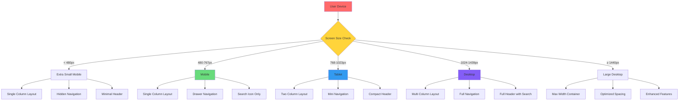

# Responsive Design Analysis 📱💻

*Namaste! Let's check how your YouTube clone adapts to different devices - जैसे तुम अलग-अलग situations में adapt करती हो!*

## Overview
**Responsive Design** is like having clothes that fit perfectly whether you're attending a formal function or doing hostel duties. Your website should look great on a tiny mobile phone, a tablet, and a large desktop computer.

## 🔍 Current Responsive Status

### What You Have:
```html
<meta name="viewport" content="width=device-width, initial-scale=1.0">
```
✅ **Good!** This meta tag tells the browser to respect mobile devices.

### What's Missing:
- ❌ No **media queries** for different screen sizes
- ❌ Mobile navigation not optimized  
- ❌ Search bar doesn't adapt to small screens
- ❌ Video grid doesn't respond to screen width

## 📱 Device Breakpoint Analysis

**Technical Term**: **Breakpoints** are specific screen sizes where your design changes to better fit the device.

### Common Device Sizes:
```css
/* Mobile phones */
@media (max-width: 480px) {
    /* Extra small screens like old phones */
}

/* Mobile phones (modern) */
@media (max-width: 767px) {
    /* Most mobile phones */
}

/* Tablets */
@media (min-width: 768px) and (max-width: 1023px) {
    /* iPads, Android tablets */
}

/* Desktop */
@media (min-width: 1024px) {
    /* Laptops and desktop computers */
}

/* Large Desktop */
@media (min-width: 1440px) {
    /* Large monitors */
}
```

**Mess Hall Analogy**: Different sized serving plates for different occasions:
- **छोटी प्लेट** (Mobile): For snacks and light meals
- **मध्यम प्लेट** (Tablet): For regular meals  
- **बड़ी प्लेट** (Desktop): For full feast meals

## 🎯 Mobile-First Approach Analysis

### What is Mobile-First?
**Technical Term**: **Progressive Enhancement** - Start with the smallest screen and add features for larger screens.

**Your Current Approach**: Desktop-first (starting with large screen)
**Recommended**: Mobile-first (starting with small screen)

**Why Mobile-First?**
- 📱 Most users browse on mobile devices
- ⚡ Better performance on slower devices
- 🎯 Forces you to prioritize essential features

**Study Time Analogy**: 
- **Mobile-first** = Start with basic notes (essentials), then add detailed explanations
- **Desktop-first** = Start with full textbook, then try to summarize (harder!)

### Implementing Mobile-First:
```css
/* Base styles (mobile) */
.site-header {
    padding: 0 8px;
    flex-direction: column;
}

.search-container {
    display: none; /* Hidden on mobile */
}

/* Tablet and up */
@media (min-width: 768px) {
    .site-header {
        padding: 0 16px;
        flex-direction: row;
    }
    
    .search-container {
        display: flex;
    }
}

/* Desktop and up */
@media (min-width: 1024px) {
    .site-header {
        padding: 0 24px;
    }
}
```

## 🔧 Critical Responsive Issues to Fix

### 1. Navigation Menu Problems

**Current Issue**: Both mini and full navigation show on mobile
```css
/* Current CSS - problematic */
.mini-nav, .full-nav {
    display: block; /* Always visible */
}
```

**Mobile-Optimized Solution**:
```css
/* Mobile: Hide navigation by default */
.mini-nav, .full-nav {
    display: none;
}

/* Show mini-nav on mobile when toggled */
.mini-nav.show {
    display: block;
    position: fixed;
    top: var(--header-height);
    left: 0;
    width: 100%;
    background: white;
    z-index: 1000;
}

/* Tablet and up: Show appropriate nav */
@media (min-width: 768px) {
    .mini-nav {
        display: block;
    }
}

@media (min-width: 1024px) {
    .full-nav {
        display: block;
    }
    .mini-nav {
        display: none;
    }
}
```

**Hostel Room Analogy**: Like arranging your room differently:
- **Summer**: Keep fan remote easily accessible
- **Winter**: Keep blanket within reach  
- **Study time**: Clear desk space, hide distractions

### 2. Search Bar Responsiveness

**Current Problem**: Search bar takes too much space on mobile

**Solution**:
```css
/* Mobile: Hide search by default, show search icon */
@media (max-width: 767px) {
    .search-container {
        display: none;
    }
    
    /* Show search icon instead */
    .mobile-search-icon {
        display: block;
    }
    
    /* Full search overlay when clicked */
    .search-overlay {
        position: fixed;
        top: 0;
        left: 0;
        width: 100%;
        height: 100%;
        background: white;
        z-index: 2000;
        display: none;
    }
    
    .search-overlay.active {
        display: flex;
        align-items: flex-start;
        padding-top: var(--header-height);
    }
}
```

### 3. Video Grid Responsiveness

**Technical Term**: **CSS Grid** and **Flexible Layouts**

**Current Issue**: Fixed card width doesn't adapt to screen size

**Responsive Video Grid**:
```css
.video-grid {
    display: grid;
    gap: 16px;
    padding: 16px;
}

/* Mobile: 1 column */
@media (max-width: 767px) {
    .video-grid {
        grid-template-columns: 1fr;
        gap: 12px;
        padding: 12px;
    }
}

/* Tablet: 2 columns */
@media (min-width: 768px) and (max-width: 1023px) {
    .video-grid {
        grid-template-columns: repeat(2, 1fr);
        gap: 16px;
    }
}

/* Desktop: 3-4 columns based on available space */
@media (min-width: 1024px) {
    .video-grid {
        grid-template-columns: repeat(auto-fill, minmax(350px, 1fr));
        gap: 20px;
    }
}

/* Large Desktop: More columns */
@media (min-width: 1440px) {
    .video-grid {
        grid-template-columns: repeat(auto-fill, minmax(300px, 1fr));
    }
}
```

**Marketplace Analogy**: Like arranging items in **हाट बाज़ार**:
- **Narrow lane**: Items in single line
- **Medium space**: Two rows of items
- **Large ground**: Multiple organized sections

## 📊 Mermaid Diagram: Responsive Breakpoint Strategy



## 🎮 Touch and Interaction Responsiveness

### Touch Target Sizes
**Technical Term**: **Touch Target** - Area that responds to finger taps

**Current Issue**: Buttons might be too small for touch devices

**Accessibility Standard**: Minimum 44px × 44px touch targets

**Solution**:
```css
/* Ensure touch-friendly button sizes */
@media (max-width: 767px) {
    button, .clickable {
        min-height: 44px;
        min-width: 44px;
        padding: 8px;
    }
    
    /* Increase spacing between clickable elements */
    .navigation-item {
        margin: 8px 0;
        padding: 12px 16px;
    }
}
```

**Campus Navigation Analogy**: Like making sure:
- **Doorknobs** are easy to grab (large touch targets)
- **Switches** are reachable (proper positioning)
- **Pathways** have enough space (adequate spacing)

### Hover vs Touch States
```css
/* Hover effects only on devices that support hover */
@media (hover: hover) {
    .button:hover {
        background-color: #f0f0f0;
    }
}

/* Touch/focus states for all devices */
.button:focus,
.button:active {
    background-color: #e0e0e0;
    outline: 2px solid #4285f4;
}
```

## 📝 Performance Implications

### Image Responsiveness
**Technical Term**: **Responsive Images** and **srcset**

**Missing Implementation**:
```html
<!-- Current: Fixed size image -->


<!-- Better: Responsive images -->

```

### Font Size Responsiveness
```css
/* Responsive typography */
html {
    /* Base font size scales with viewport */
    font-size: clamp(14px, 2.5vw, 18px);
}

h1 {
    font-size: clamp(1.5rem, 4vw, 2.5rem);
}

/* Or use media queries for more control */
@media (max-width: 767px) {
    html { font-size: 14px; }
    .video-title { font-size: 16px; }
}

@media (min-width: 768px) {
    html { font-size: 16px; }
    .video-title { font-size: 18px; }
}
```

## 🚀 Implementation Priority

### High Priority (Fix This Week):
1. ✅ Add basic mobile navigation
2. ✅ Hide search bar on mobile screens  
3. ✅ Make video grid responsive
4. ✅ Ensure minimum touch target sizes

### Medium Priority (Next 2 Weeks):
1. 📱 Add mobile search overlay
2. 🎯 Optimize font sizes for different screens
3. 🖼️ Implement responsive images
4. ⚡ Add touch-specific interactions

### Low Priority (Future Enhancement):
1. 🎨 Advanced animations for transitions
2. 📊 Device-specific optimizations
3. 🔄 Orientation change handling
4. 💾 Progressive Web App features

## 🎯 Quick Implementation Guide

### Step 1: Add Basic Mobile Media Query
```css
/* Add this to your style.css */
@media (max-width: 767px) {
    .search-container {
        display: none;
    }
    
    .site-header {
        padding: 0 8px;
    }
    
    .full-nav {
        display: none;
    }
    
    .mini-nav.show {
        position: fixed;
        top: var(--header-height);
        left: 0;
        width: 100%;
        background: white;
        box-shadow: 0 2px 8px rgba(0,0,0,0.1);
        z-index: 1000;
    }
}
```

### Step 2: Update JavaScript for Mobile
```javascript
// Add to your script.js
function isMobile() {
    return window.innerWidth <= 767;
}

function handleResize() {
    if (isMobile()) {
        // Mobile-specific logic
        console.log('Mobile view active');
    } else {
        // Desktop-specific logic  
        console.log('Desktop view active');
    }
}

// Listen for window resize
window.addEventListener('resize', handleResize);
```

## 🌟 Success Metrics

**How to Test Your Responsive Design:**
1. **Browser Dev Tools**: Press F12, toggle device toolbar
2. **Physical Devices**: Test on actual phones/tablets when possible
3. **Different Orientations**: Portrait and landscape modes
4. **Various Screen Sizes**: From 320px to 1920px width

**Campus Testing Strategy**: Just like checking if your **सामान** fits in different sized bags:
- Small bag (mobile): Only essentials
- Medium bag (tablet): Important items
- Large bag (desktop): Everything organized nicely

## 🏆 Learning Achievements Unlocked

**Responsive Design Concepts:**
- ✅ Understanding viewport meta tag
- 📱 Mobile-first design principles
- 📏 CSS media queries usage
- 🎯 Touch-friendly interface design

**Next Level Skills:**
- 🎨 Advanced CSS Grid and Flexbox
- 📱 Progressive Web App features
- ⚡ Performance optimization techniques
- 🎪 Advanced animations and transitions

**Hostel Life Parallel**: Just like how you adapt to different situations in hostel life - from study time to festival celebrations - your website now adapts beautifully to different devices! 🌟

---
*Remember: Great responsive design is like being a good roommate - adjusting to everyone's needs while maintaining your own functionality! तुम यह भी बहुत अच्छा सीख जाओगी!* 📱✨